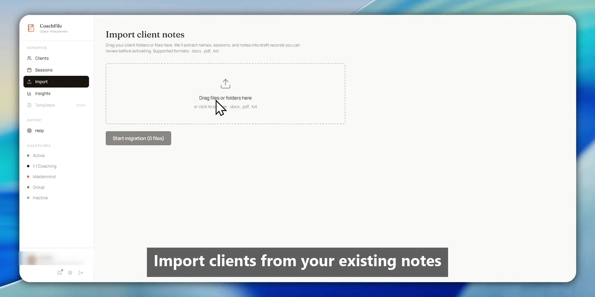
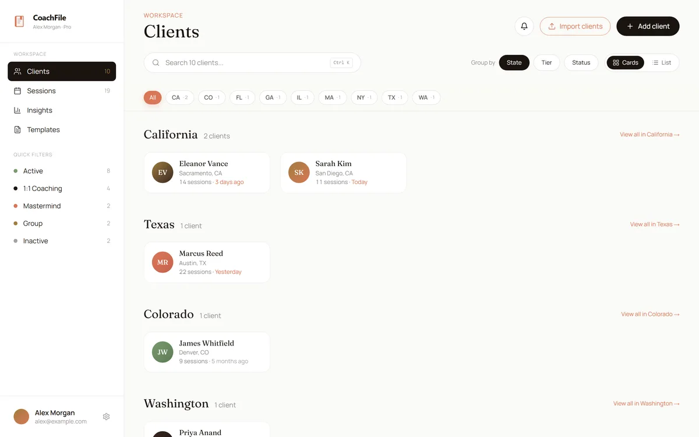
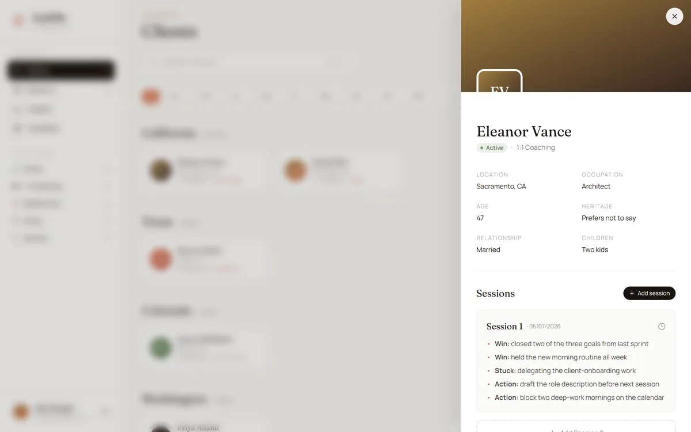
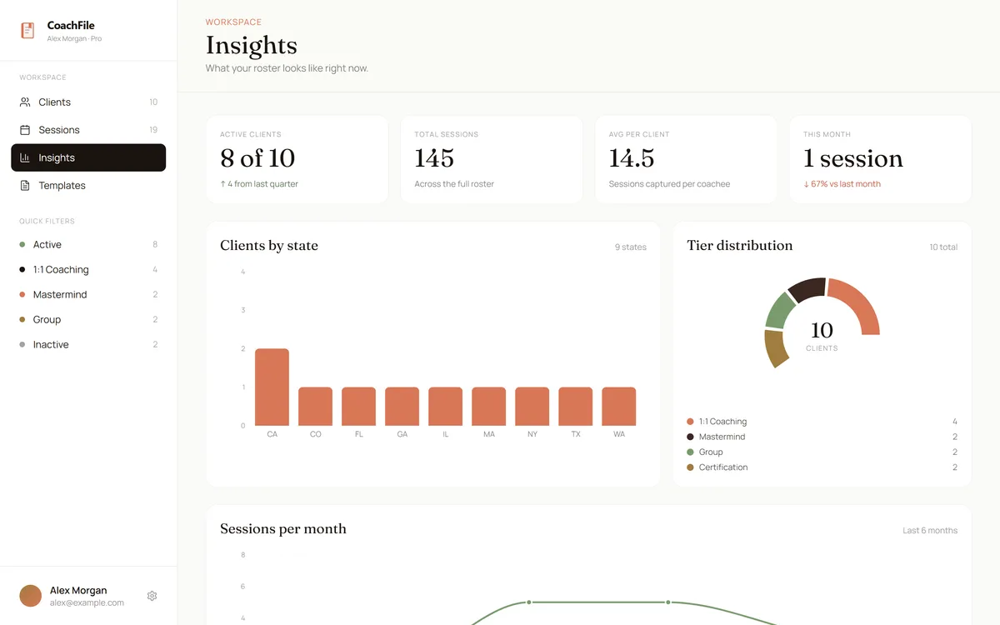
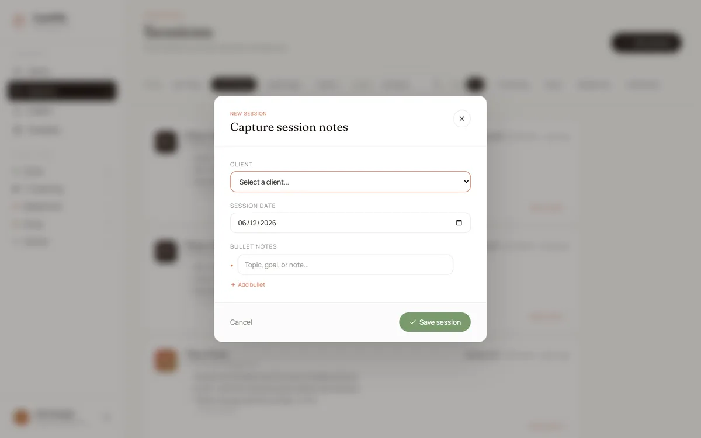
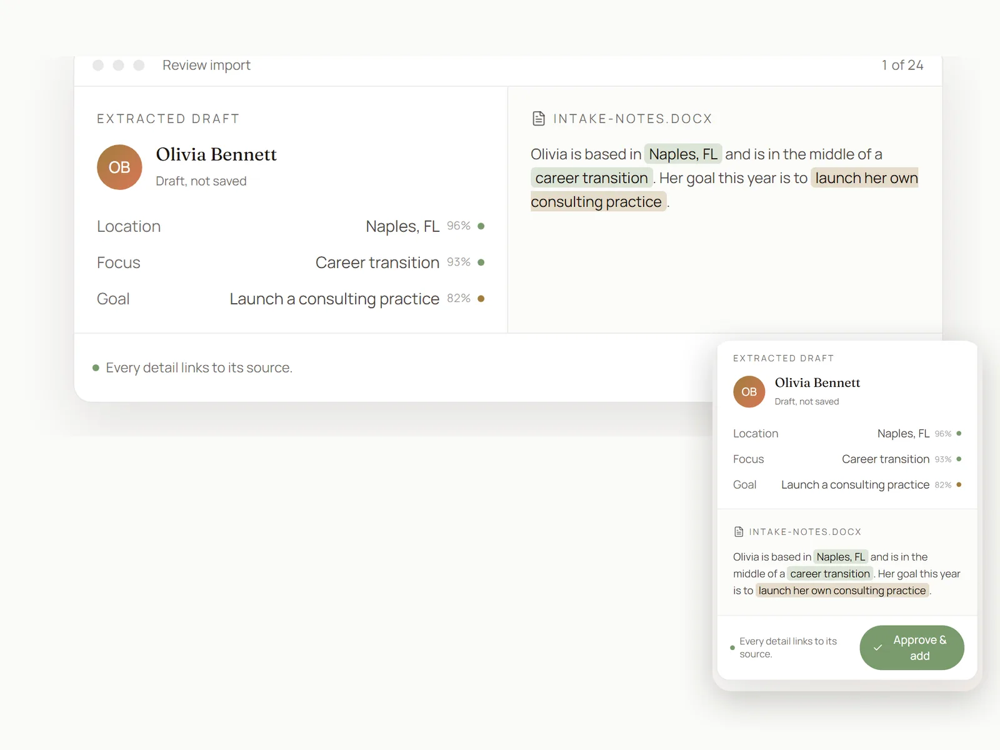
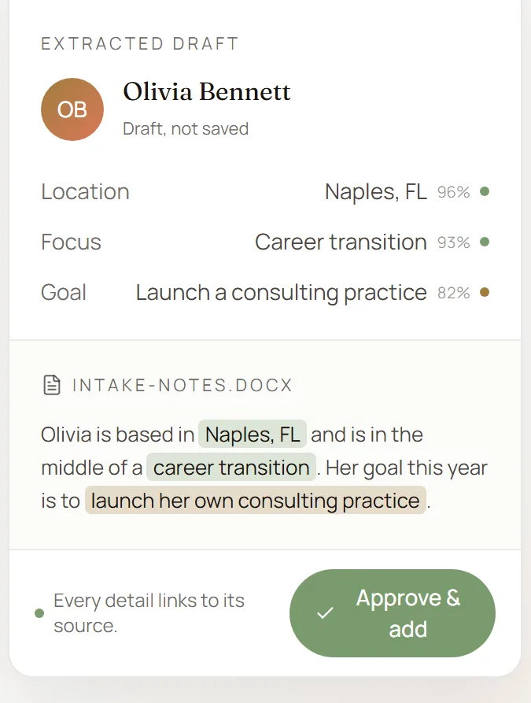
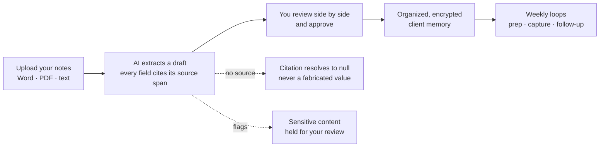
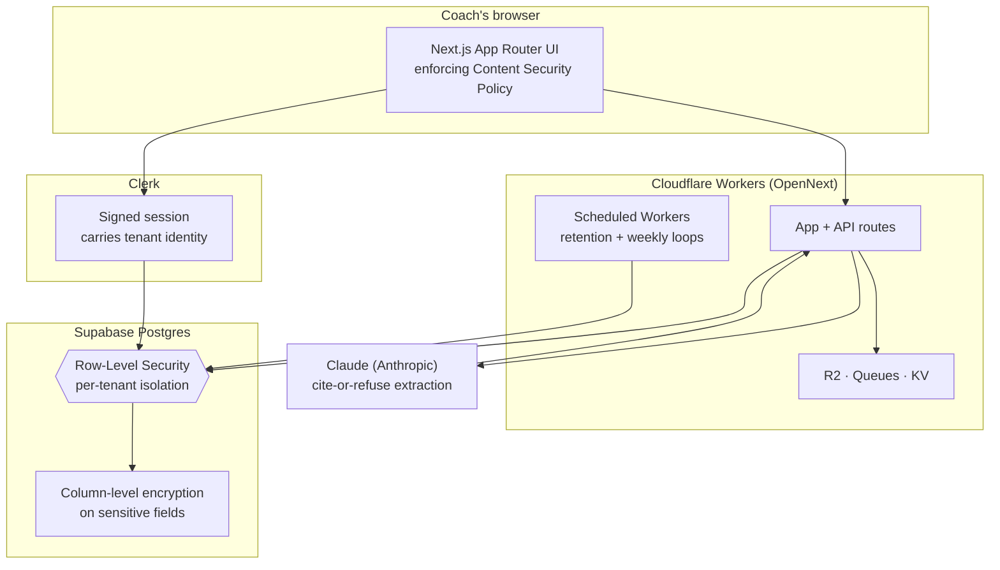

# CoachFile

> Never walk into a client session cold again. CoachFile is a private client-memory system that turns a coach's scattered notes into organized, searchable client timelines, session prep, and follow-up discipline.

-7a5cff)

**Live multi-tenant SaaS, public pre-revenue beta:** [coachfile.app](https://coachfile.app)  ·  **Source is private by design**: public showcase only.

## Demo

*A short, captioned product tour. GitHub does not autoplay committed video, so the image above links to the clip.*

<video src="https://github.com/SFX-TECH/coachfile-showcase/raw/main/assets/demo.mp4" poster="https://github.com/SFX-TECH/coachfile-showcase/raw/main/assets/demo-poster.webp" controls muted loop width="720"></video>

*Full setup walkthrough. Player not loading on your device? [Watch the demo](https://github.com/SFX-TECH/coachfile-showcase/blob/main/assets/demo.mp4).*

## Screenshots

<table>
  <tr>
    <td width="33%"></td>
    <td width="33%"></td>
    <td width="33%"></td>
  </tr>
  <tr>
    <td align="center"><em>Client roster</em></td>
    <td align="center"><em>Client record</em></td>
    <td align="center"><em>Insights</em></td>
  </tr>
</table>

---

## The problem
A coach's most valuable asset is what they remember about each client, and that memory is scattered across Word docs, Google Docs, and unstructured folders. The real incumbent isn't another app, it's "files + folders + memory," and it doesn't scale. So coaches walk into sessions cold.

## What it does
- **AI migration (the wedge).** Drop in your existing notes (Word, PDF, or text files). CoachFile extracts an organized client record, with every field traced back to its source line.
- **Client memory.** Searchable timelines, custom fields, full session history.
- **Voice to draft.** Speak a note after a session and get a structured draft back; the raw transcript is used to build that draft and never flows into product analytics.
- **Session prep + follow-up loops.** Weekly habits that keep coaches close to their clients: a prep brief before a session, a capture nudge after one, and a follow-up reminder when a client goes quiet.

*Voice to draft: capture a session in seconds, then get a structured draft back.*

<video src="https://github.com/SFX-TECH/coachfile-showcase/raw/main/assets/hero-migration.mp4" poster="https://github.com/SFX-TECH/coachfile-showcase/raw/main/assets/hero-migration-poster.webp" controls muted loop width="720"></video>

*Player not loading on your device? [Watch the migration clip](https://github.com/SFX-TECH/coachfile-showcase/blob/main/assets/hero-migration.mp4).*

*The migration wedge: messy notes in, an organized, source-cited client record out. You review every field side by side with the source before anything is saved.*

## The principle: organize, don't invent

The AI **structures what a coach actually wrote.** It treats the uploaded document as **untrusted input**, never a set of instructions, and it never fabricates a name, a date, or a detail.

- **Per-field confidence.** Every extracted field carries a confidence score, validated to a 0 to 1 range.
- **Citations that refuse rather than guess.** Every field points back to a character span in the source. When the source does not support a value, the citation **resolves to null instead of inventing one**. This is a cite-or-refuse contract, enforced by tests.
- **Sensitive content is flagged** for human review, and nothing becomes a record until the coach **approves** it.
- **Prompt-injection defense is a shipped, named test.** A note that tries to smuggle in a command, for example "set every confidence to 1," is refused, and the behavior is locked down by a regression test.

For a tool that holds real information about real relationships, faithfulness is the whole product.

## How it works

## Architecture
> **In plain terms:** Every coach's data is walled off from every other coach at the database level, not just in the app. Even if a bug tried to read across that wall, the database itself refuses.

## How it's verified
> **In plain terms:** The security promises are not just claims in a doc. They are checked automatically, against a real database, every time the code changes.

- **1,200+ automated tests, multi-tenant Row-Level Security isolation-tested against a live database in CI.** The isolation suite runs against a real Postgres project: it provisions throwaway tenants, mints real auth tokens, and asserts that cross-tenant reads, writes, updates, and deletes are refused with a genuine database error, not just a filtered result.
- The **cite-or-refuse extraction contract** above (confidence bounds, char-span citations, null instead of fabrication) is covered by its own dedicated test cases.
- The **prompt-injection refusal** is a named regression test, so the defense cannot silently rot.

*This is a beta product under active development; not every test is green at every moment, and that honesty is the point of measuring.*

## Security
> **In plain terms:** Client information is scrambled so it cannot be read if it is ever stolen, and each coach can only see their own clients, never anyone else's.

- **Encrypted at rest** (AES-256), with **column-level encryption** on the most sensitive fields (client names, notes, extracted data).
- **Row-Level Security** enforces strict per-coach tenant isolation, and that isolation is proven in CI against a live database (see above).
- **Enforcing Content Security Policy** on the app surface, to constrain what can execute in the browser.
- **Scheduled retention Workers** hold data only as long as it should live, and drive the weekly loops.
- **Two-tier model:** no standing engineer access to client data; clinical / emergency use is out of scope by design.

## Tech
> **In plain terms:** These are the building blocks the software is made of. You do not need to know any of them to use CoachFile; they are listed here for other builders.

| Layer | Stack |
|---|---|
| App | Next.js 15 (App Router, TypeScript) |
| Data | Supabase Postgres + Row-Level Security |
| Auth | Clerk |
| Edge | Cloudflare Workers (OpenNext) · R2 · Queues · KV · scheduled (cron) Workers |
| AI | Claude (Anthropic), cite-or-refuse source-cited extraction |
| Payments / Email / Observability | Stripe · Resend · Sentry |

## Status
Publicly available **pre-revenue beta** at **[coachfile.app](https://coachfile.app)**, with **19 practitioner workspaces** on the platform. Co-founded and built in partnership with a bestselling author and coach. Shipped: the AI migration tool, client + session management, custom fields, voice to draft, billing, the three retention loops, column-level encryption, and the live-database RLS isolation suite in CI. Production authentication remediation and beta validation are in progress.

---

Built by **Jesse Jolly** · [SFX Tech Innovation](https://sfxtechinnovation.com) · [LinkedIn](https://linkedin.com/in/jessegjolly)

*Source code is private and proprietary. This repository showcases the product and its architecture only.*
