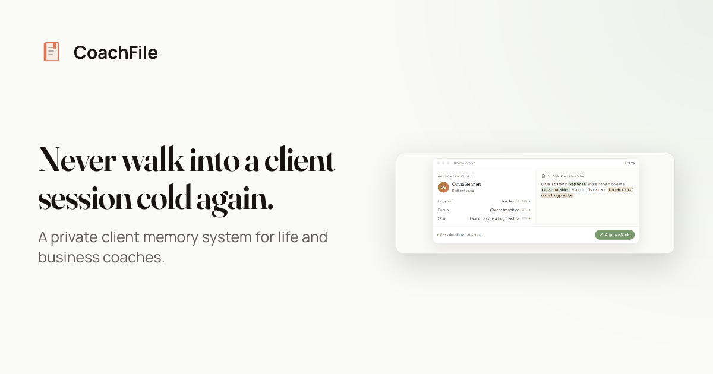
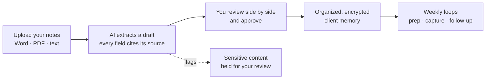

# CoachFile

> Never walk into a client session cold again. CoachFile is a private client-memory system that turns a coach's scattered notes into organized, searchable client timelines, session prep, and follow-up discipline.

-7a5cff)

**Live:** [coachfile.app](https://coachfile.app)  ·  **Source is private by design**: public showcase only.

## Demo
<video src="https://github.com/SFX-TECH/coachfile-showcase/raw/main/assets/demo.mp4" poster="https://github.com/SFX-TECH/coachfile-showcase/raw/main/assets/demo-poster.webp" controls muted loop width="720"></video>

*Player not loading on your device? [Watch the demo](https://github.com/SFX-TECH/coachfile-showcase/blob/main/assets/demo.mp4).*

---

## The problem
A coach's most valuable asset is what they remember about each client, and that memory is scattered across Word docs, Google Docs, and unstructured folders. The real incumbent isn't another app, it's "files + folders + memory," and it doesn't scale. So coaches walk into sessions cold.

## What it does
- **AI migration (the wedge).** Drop in your existing notes (Word, PDF, or text files). CoachFile extracts an organized client record, with every field traced back to its source line.
- **Client memory.** Searchable timelines, custom fields, full session history.
- **Session prep + follow-up loops.** Weekly habits that keep coaches close to their clients: a prep brief before a session, a capture nudge after one, and a follow-up reminder when a client goes quiet.

## The principle: organize, don't invent
The AI **structures what a coach actually wrote.** It never fabricates a name, a date, or a detail. Every extracted field carries a **source citation**, sensitive content is **flagged for human review**, and nothing becomes a record until the coach **approves** it. For a tool that holds real information about real relationships, faithfulness is the whole product.

## How it works

## Security
> **In plain terms:** Client information is scrambled so it cannot be read if it is ever stolen, and each coach can only see their own clients, never anyone else's.

- **Encrypted at rest** (AES-256), with **column-level encryption** on the most sensitive fields (client names, notes, extracted data).
- **Row-Level Security** enforces strict per-coach tenant isolation, verified on every change.
- **Two-tier model:** no standing engineer access to client data; clinical / emergency use is out of scope by design.

## Tech
> **In plain terms:** These are the building blocks the software is made of. You do not need to know any of them to use CoachFile; they are listed here for other builders.

| Layer | Stack |
|---|---|
| App | Next.js 15 (App Router, TypeScript) |
| Data | Supabase Postgres + Row-Level Security |
| Auth | Clerk |
| Edge | Cloudflare Workers (OpenNext) · R2 · Queues · KV |
| AI | Claude (Anthropic), source-cited extraction |
| Payments / Email / Observability | Stripe · Resend · Sentry |

## Status
Live at **[coachfile.app](https://coachfile.app)**. Co-founded and built in partnership with a bestselling author and coach. Shipped: the AI migration tool, client + session management, custom fields, billing, the three retention loops, and column-level encryption.

---

Built by **Jesse Jolly** · [SFX Tech Innovation](https://sfxtechinnovation.com) · [LinkedIn](https://linkedin.com/in/jessegjolly)

*Source code is private and proprietary. This repository showcases the product and its architecture only.*
